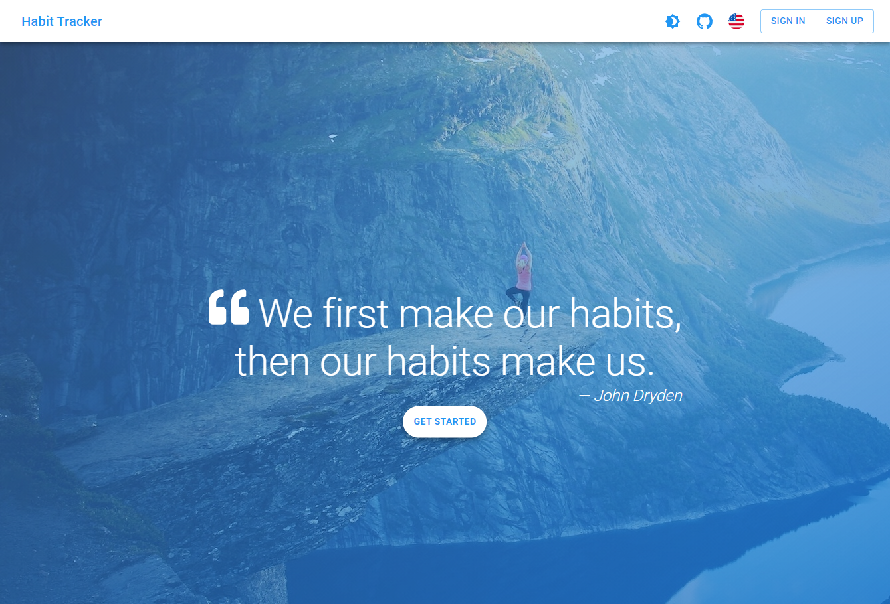
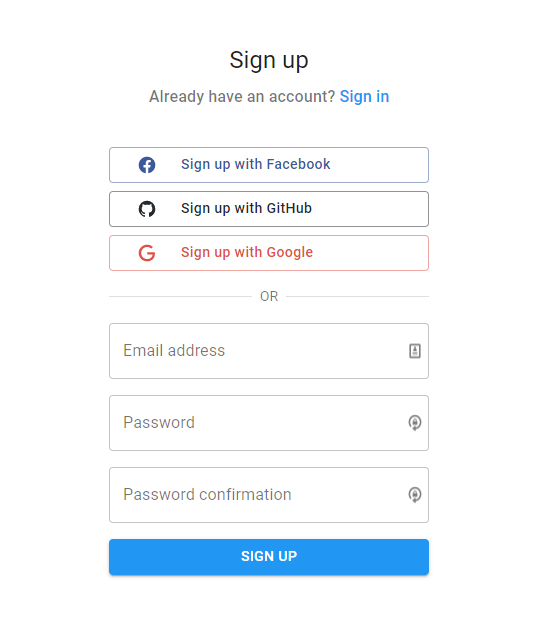
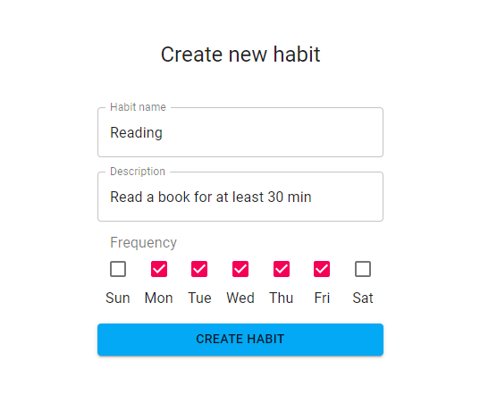
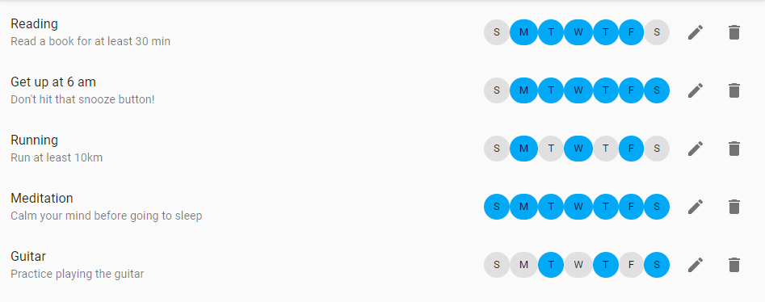
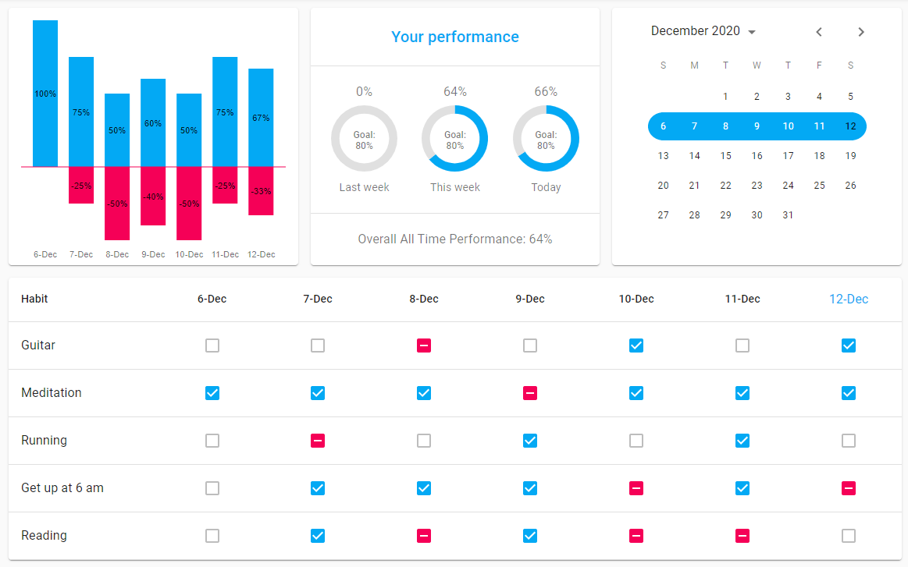
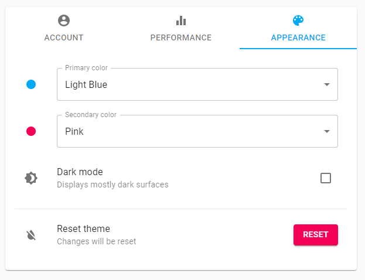
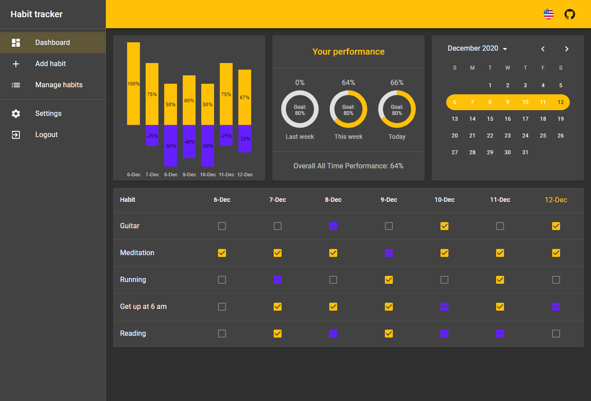

# Habit Tracker

## Table of Contents

* [About](#about)
* [Features and Stack](#features-and-stack)
* [Screenshots](#screenshots)
* [Getting Started](#getting-started)
* [Challenges](#challenges)
* [Create React App](#bootstrapped-with-create-react-app)

## About

**Habit Tracker** is my final project for [CS50's Introduction to Computer Science Course](https://www.edx.org/course/cs50s-introduction-to-computer-science).
What can I say, **Habit Tracker** keeps track of your habits :fireworks: :ok_hand: :tada:

### Video presentation

A short video (2 minutes in length) where I present the project.

[](https://www.youtube.com/watch?v=zIr_d1ZsIGQ)

## Features and Stack

### Features
* create an account with using email and password
* authenticate using Facebook, GitHub or Google
* login as a guest
* add, edit and delete habits
* mark the habits as `completed`, `failed` or `skipped`
* weekly performance is visualized in a bar chart
* brief summary of performance for last week, current week, current day and all time
* customize the app by changing `primary` and `secondary` color
* toggle dark mode
* choose your language: `ES | EN | PL`

### Stack

* React
* React Query
* React Router
* React Hook Form
* Material UI
* Firebase
  * Authentication
  * Realtime Database
  
## Screenshots

* Landing Page



* Sign up using **Facebook**, **GitHub**, **Google** or create a new account using your email address.



* Create new habit



* Manage your habits - preview, edit or delete your habits



* Keep track of your habits in the Dashboard



* Change your settings



* Customize the app the way you want



## Getting started

Below you'll find the instructions for setting up the project locally and a walkthrough video, where I'm following these instructions. 

[](https://youtu.be/-Iv88vi71gM)

### Clone repo and install dependencies

```bash
# Clone the repo
git clone https://github.com/sitek94/habit-tracker-app.git

# Install dependencies
cd habit-tracker-app
yarn
```

### Connect Firebase

While you’re waiting for the dependencies to install, you can set up the Firebase.

1. Login to [Firebase](https://console.firebase.google.com/)
2. Create project
3. Create Realtime Database
   1. In step 2, check “Start in **test mode”**
4. Authentication > Sign-in method > Sign-in providers, and add the following:
   1. Email/Password
   2. Google
   3. Anonymous
   4. (Optional): If you want to add Facebook and/or GitHub, you’ll have to get Client IDs and secrets from these services
5. Go to Project Overview and add a web app
6. You don’t need to run `npm install firebase`, it’s already installed
7. You should see a `firebaseConfig` similar to this:

    ```bash
    const firebaseConfig = {
      apiKey: "<YOUR_API_KEY>",
      authDomain: "<YOUR_AUTH_DOMAIN>",
      databaseURL: "<YOUR_DATABASE_URL>",
      projectId: "<YOUR_PROJECT_ID>",
      storageBucket: "<YOUR_STORAGE_BUCKET>",
      messagingSenderId: "<YOUR_MESSAGING_SENDER_ID>",
      appId: "<YOUR_APP_ID>",
      measurementId: "<YOUR_MEASUREMENT_ID>",
    };
    ```

8. Create `.env.local` file, by duplicating `.env.local.example`, and use config above to fill it out

### Start the app

```bash
# Start development server
yarn start
```
The app should be running at: [http://localhost:3000](http://localhost:3000/)

## Challenges

I learned a lot while building the project and for sure I'm going to learn a lot more while maintaining it. 
That's why I want to keep track of the challenges that I've had along the way so that I can reference them in the future.

### Database and data structure

How should I store habit's completion state for each day? Should each habit have an array with the dates 
when it was performed or should I store dates and each date would keep track of the habits that where performed on that day? 

I tried to structure the data so that it is saved and retrieved as easily as possible. To do so I've been following 
[Firebase guidelines](https://firebase.google.com/docs/database/web/structure-data) and in the end came up with the following data structure:

```json
{
    "habits": {
        "user-one": {
            "habit-one": {
                "name": "Reading",
                "description": "Read a book for at least 30 min in the morning",
                "frequency": [0,1,2,3,4]
            }
        }
    },
    "checkmarks": {
        "user-one": {
            "checkmark-id": {
                "habitId": "habit-one",
                "date": "2020-11-11",
                "value": "completed"
            }
        }
    },
    "users": {
        "user-one": {
            "locale": {
                "code": "en-GB"
            },
            "theme": {
                "primaryColor": "blue",
                "secondaryColor": "red",
                "dark": true
            },
            "performanceGoal": 80
        }
    }
}
```

### Authentication Layer

For quite some time I was using Private and Public routes to prevent an authenticated user from accessing the parts of the app available only for logged in user.
It was fine, but I wanted to use a different layout for authenticated users (additional sidebar on the left).

I found the perfect solution in a [blog post by Kent C. Dodds](https://kentcdodds.com/blog/authentication-in-react-applications):

```jsx
function App() {
  const user = useUser();
  return user ? <AuthenticatedApp /> : <UnauthenticatedApp />;
}
```

### Localization and language

I've never before implemented this in an app, and I really wanted to give it a try. My main goal was to give the user an option to change their locale and language.
Although this goal was achieved, the solution is far from ideal. First, I think that it would be better to split these two layers. For example in YouTube one
can open settings and change either Language or Location.

## Bootstrapped with Create React App

This project was bootstrapped with [Create React App](https://github.com/facebook/create-react-app).

For the detailed description of available scripts see [CRA Documentation](https://create-react-app.dev/docs/available-scripts)
